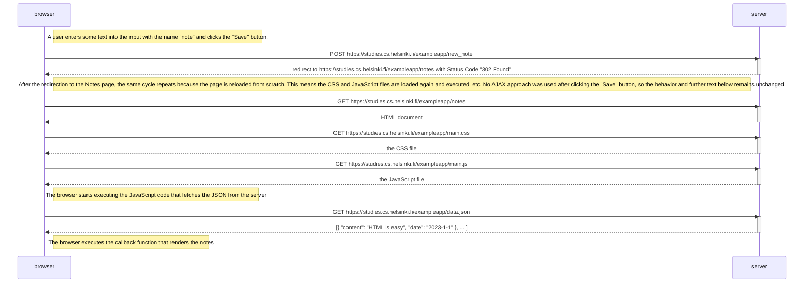

````markdown
## Part 0. Task 0.4 – New Note Diagram


```mermaid
sequenceDiagram
participant browser
participant server

Note right of browser: A user enters some text into the input with the name "note" and clicks the "Save" button.

browser->>server: POST https://studies.cs.helsinki.fi/exampleapp/new_note
activate server
server-->>browser: redirect to https://studies.cs.helsinki.fi/exampleapp/notes with Status Code "302 Found"
deactivate server

Note right of browser: After the redirection to the Notes page, the same cycle repeats because the page is reloaded from scratch. This means the CSS and JavaScript files are loaded again and executed, etc. No AJAX approach was used after clicking the "Save" button, so the behavior and further text below remains unchanged.

browser->>server: GET https://studies.cs.helsinki.fi/exampleapp/notes
activate server
server-->>browser: HTML document
deactivate server

browser->>server: GET https://studies.cs.helsinki.fi/exampleapp/main.css
activate server
server-->>browser: the CSS file
deactivate server

browser->>server: GET https://studies.cs.helsinki.fi/exampleapp/main.js
activate server
server-->>browser: the JavaScript file
deactivate server

Note right of browser: The browser starts executing the JavaScript code that fetches the JSON from the server

browser->>server: GET https://studies.cs.helsinki.fi/exampleapp/data.json
activate server
server-->>browser: [{ "content": "HTML is easy", "date": "2023-1-1" }, ... ]
deactivate server

Note right of browser: The browser executes the callback function that renders the notes
```
````
