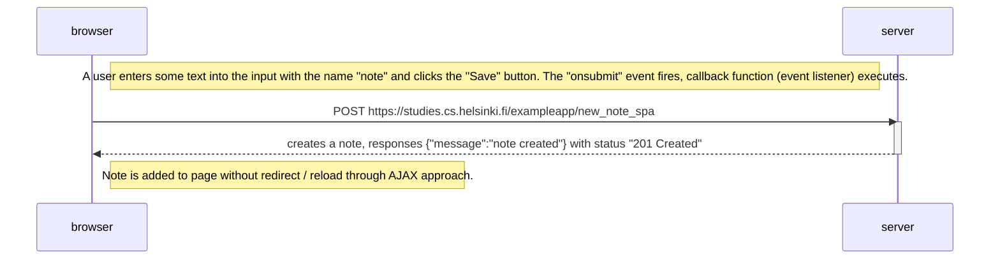

```mermaid
sequenceDiagram
participant browser
participant server

Note right of browser: A user enters some text into the input with the name "note" and clicks the "Save" button. The "onsubmit" event fires, callback function (event listener) executes.

browser->>server: POST https://studies.cs.helsinki.fi/exampleapp/new_note_spa
activate server
server-->>browser: creates a note, responses {"message":"note created"} with status "201 Created"
deactivate server

Note right of browser: Note is added to page without redirect / reload through AJAX approach.
```
