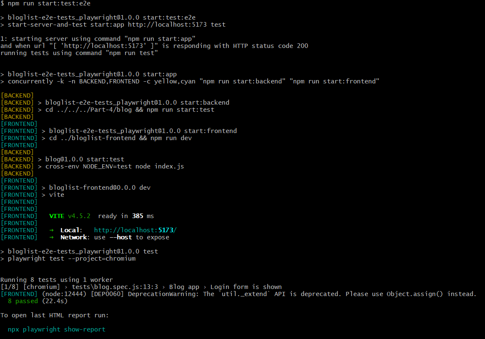
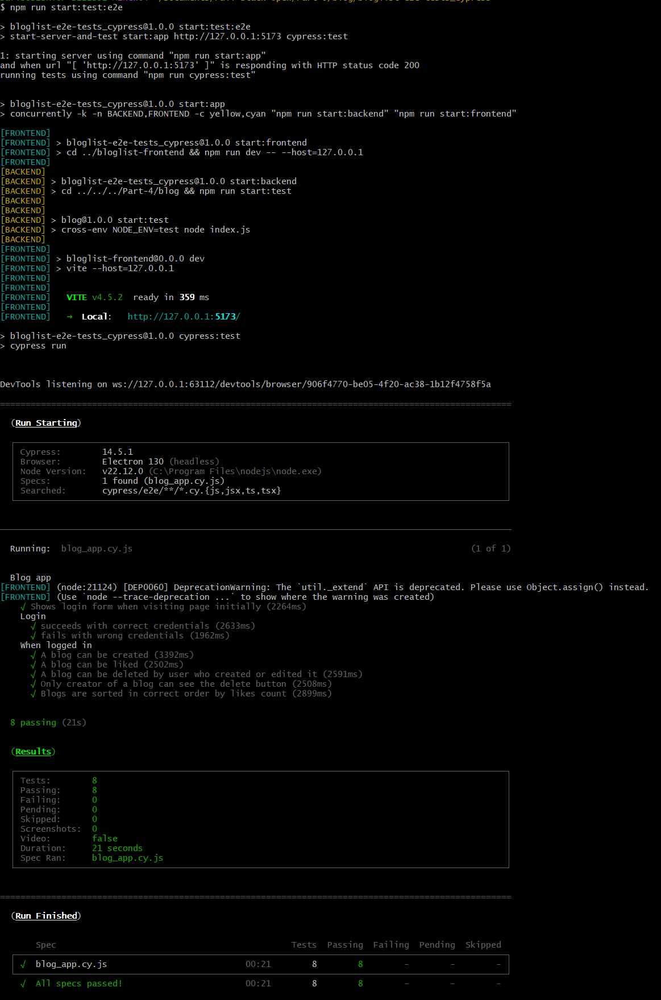

# Part 5 – Testing React apps

Although the course allows choosing **either Playwright or Cypress**, I decided to explore both libraries and practice with each. As a result, I completed the same set of tasks using both tools.

---

## 🌐 Main Frontend

The main frontend app is located at:

```
Part-5/blog/bloglist-frontend
```

To run **both frontend and backend** (from Part 4) in development mode, use:

```
npm run start:full:dev
```

---

## 🎭 E2E Tests – Playwright

Playwright-based tests are located in:

```
Part-5/blog/bloglist-e2e-tests_Playwright
```

To start the backend (from Part 4), the frontend, and run the Playwright tests in one command:

```
npm run start:test:e2e
```

Make sure you have a MongoDB instance running and configured.

✅ Example output:



---

## 🧪 E2E Tests – Cypress

Cypress-based tests are located in:

```
Part-5/blog/bloglist-e2e-tests_Cypress
```

To start the backend (from Part 4), the frontend, and run the Cypress tests in one command:

```
npm run start:test:e2e
```

Again, ensure a working MongoDB connection.

✅ Example output:


